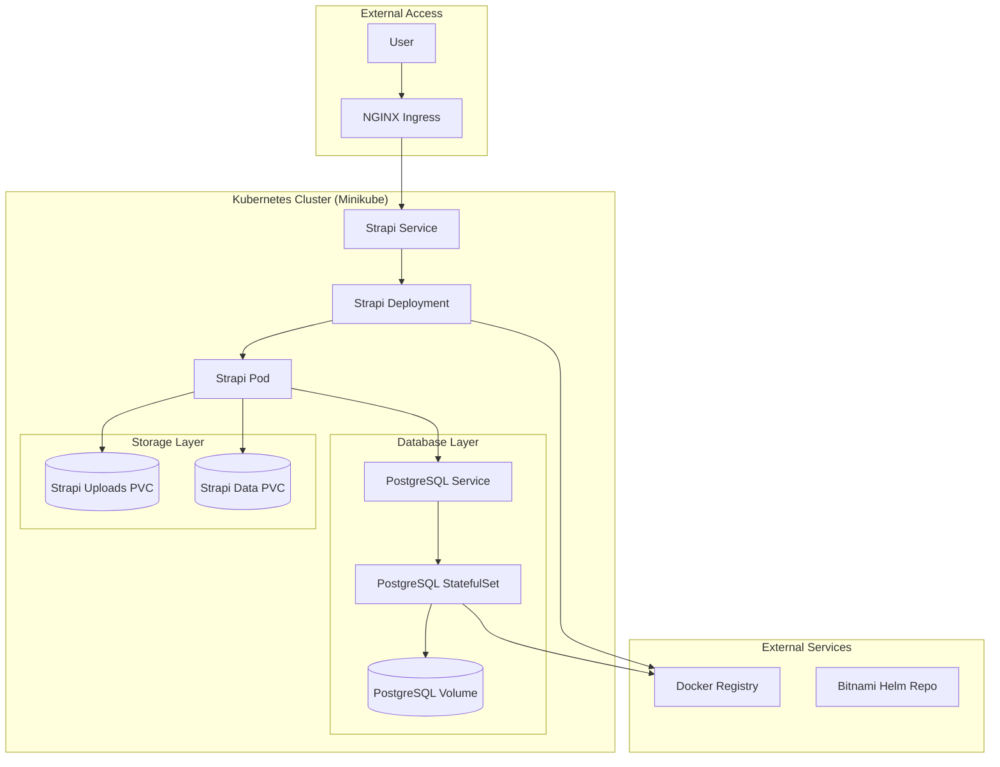
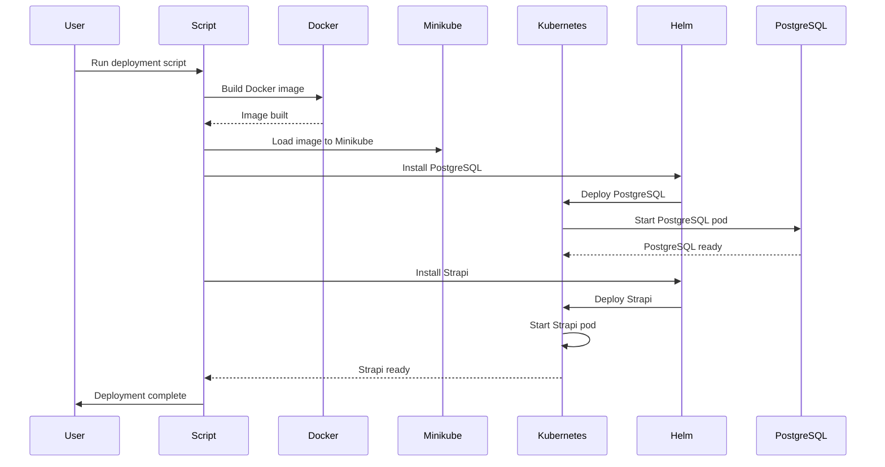
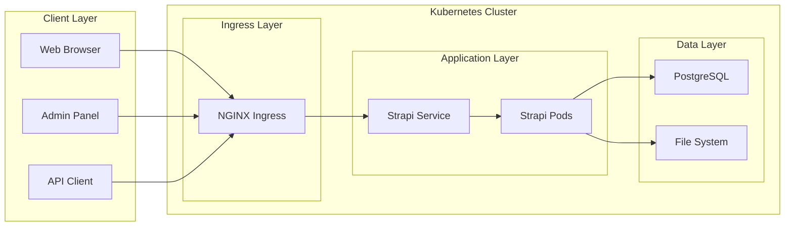
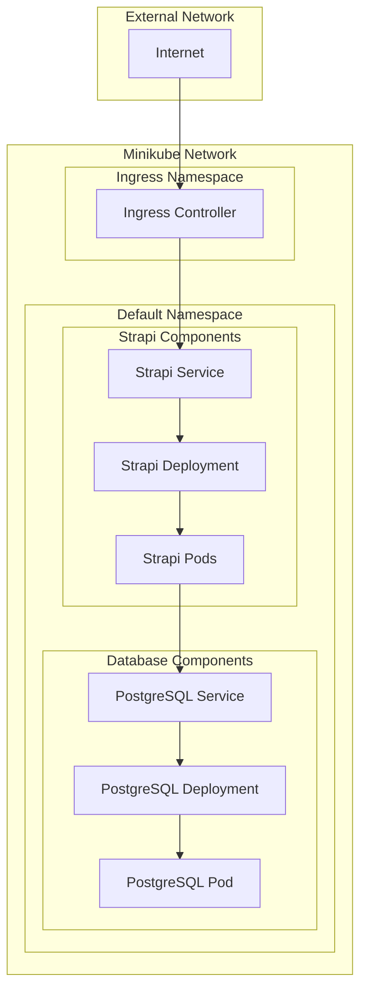
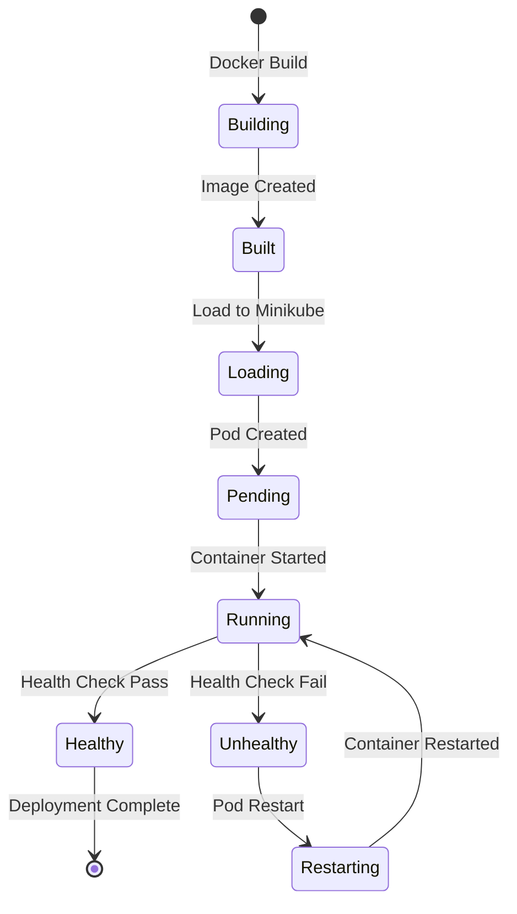
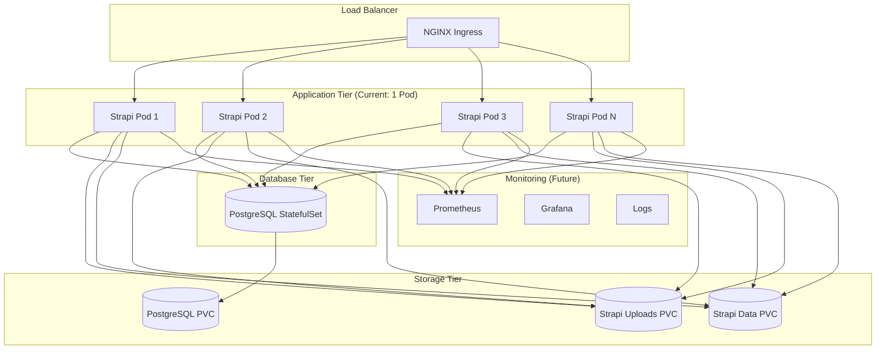
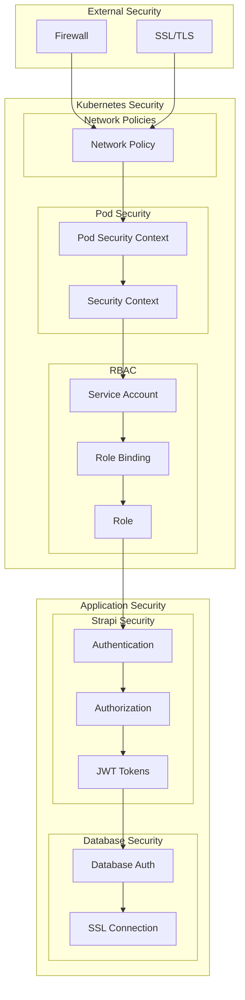
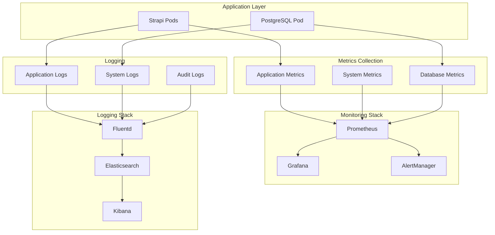
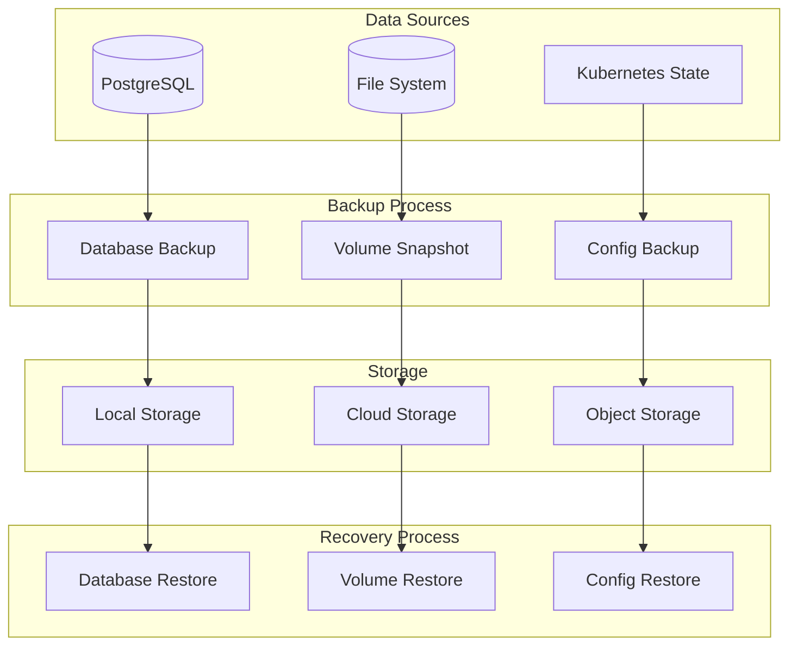
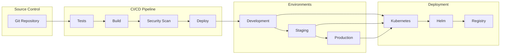

# Architecture Diagrams

This file contains Mermaid diagrams for the Strapi Kubernetes deployment. You can render these diagrams using Mermaid-compatible tools like GitHub, GitLab, or online Mermaid editors.

## System Architecture

## Deployment Flow

## Data Flow

## Network Topology

## Container Lifecycle

## Scaling Architecture

## Security Architecture

## Monitoring and Observability

## Backup and Recovery

## CI/CD Pipeline

## How to Use These Diagrams

### Online Tools
1. **Mermaid Live Editor**: https://mermaid.live/
2. **GitHub/GitLab**: These platforms render Mermaid diagrams automatically
3. **VS Code**: Install the Mermaid extension

### Local Tools
1. **Mermaid CLI**: `npm install -g @mermaid-js/mermaid-cli`
2. **Pandoc**: Convert to various formats
3. **Draw.io**: Import Mermaid diagrams

### Integration
- Copy the Mermaid code into your documentation
- Use in README files for GitHub repositories
- Include in technical documentation
- Create presentations with diagram tools
