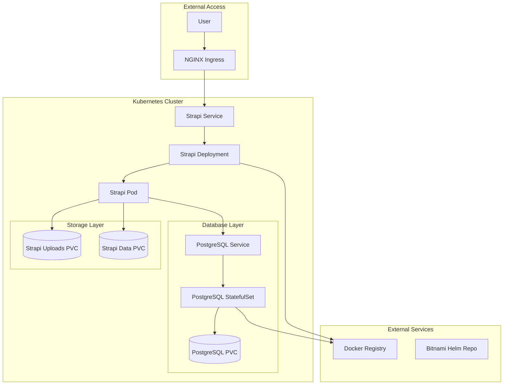
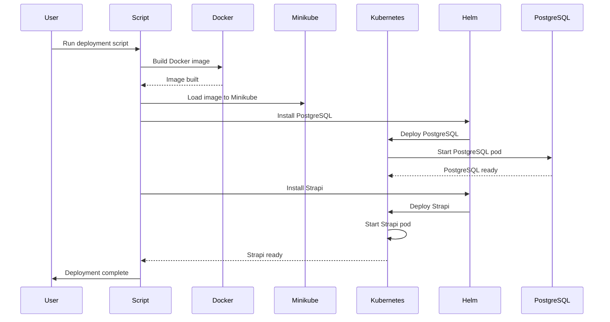
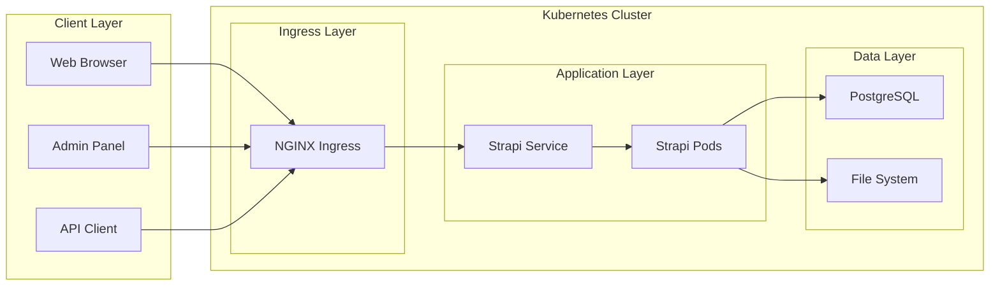
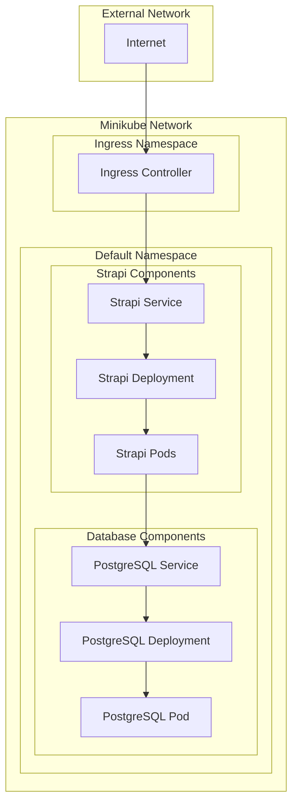

# Strapi Kubernetes Deployment Guide

A comprehensive guide for deploying Strapi CMS on Kubernetes using Minikube, Helm, and Docker.

## Table of Contents

1. [Architecture Overview](#architecture-overview)
2. [Technology Stack](#technology-stack)
3. [Prerequisites](#prerequisites)
4. [Quick Start](#quick-start)
5. [Detailed Deployment](#detailed-deployment)
6. [Architecture Diagrams](#architecture-diagrams)
7. [Troubleshooting](#troubleshooting)
8. [Learning Resources](#learning-resources)
9. [Production Considerations](#production-considerations)

## Architecture Overview

This deployment creates a cloud-native Strapi CMS with the following components:

- **Strapi Application**: Headless CMS running in Kubernetes pods
- **PostgreSQL Database**: Persistent data storage with Bitnami Helm chart
- **NGINX Ingress**: External access and load balancing
- **Persistent Volumes**: Data persistence for uploads, application data, and database
- **Helm Charts**: Package management for Kubernetes applications
- **Minikube**: Local Kubernetes development environment

## Technology Stack

| Component | Technology | Purpose |
|-----------|-------------|---------|
| **Container Runtime** | Docker | Application containerization |
| **Orchestration** | Kubernetes | Container orchestration and management |
| **Local Cluster** | Minikube | Local Kubernetes development environment |
| **Package Manager** | Helm | Kubernetes application packaging |
| **Database** | PostgreSQL 17.6.0 | Relational database for Strapi |
| **Web Server** | NGINX Ingress | External access and routing |
| **CMS** | Strapi v5.23.1 | Headless content management system |
| **Language** | Node.js 18 Alpine | Runtime environment |
| **Database Chart** | Bitnami PostgreSQL 16.7.27 | Helm chart for database |

## Prerequisites

### Required Software

```bash
# Install Docker
# macOS with Homebrew
brew install --cask docker

# Install Minikube
brew install minikube

# Install kubectl
brew install kubectl

# Install Helm
brew install helm
```

### System Requirements

- **RAM**: Minimum 4GB, Recommended 8GB+
- **CPU**: 2+ cores
- **Storage**: 20GB+ free space
- **OS**: macOS, Linux, or Windows with WSL2

## Quick Start

### 1. Start Minikube

```bash
# Start Minikube with sufficient resources
minikube start --memory=4096 --cpus=2

# Enable required addons
minikube addons enable ingress
```

### 2. Deploy Strapi

```bash
# Run the interactive deployment script
./scripts/quick-start.sh

# Or use direct deployment
./scripts/deploy-standalone.sh
```

### 3. Access Your Application

```bash
# Port forward for local access
kubectl port-forward svc/strapi 1337:1337

# Access Strapi admin
open http://localhost:1337/admin
```

## Detailed Deployment

### Project Structure

```
my-strapi-project/
├── Dockerfile                 # Container image definition
├── .dockerignore             # Docker ignore patterns
├── helm/strapi/              # Helm chart directory
│   ├── Chart.yaml            # Chart metadata
│   ├── values.yaml           # Default configuration
│   ├── values-production.yaml # Production configuration
│   └── templates/            # Kubernetes manifests
│       ├── deployment.yaml   # Application deployment
│       ├── service.yaml      # Service definition
│       ├── ingress.yaml      # External access
│       ├── pvc.yaml          # Persistent volumes
│       └── _helpers.tpl      # Template helpers
├── scripts/                  # Deployment automation
│   ├── quick-start.sh        # Interactive deployment
│   ├── deploy-standalone.sh  # Standalone deployment
│   ├── deploy-to-minikube.sh # Helm deployment
│   └── cleanup.sh            # Cleanup scripts
└── DEPLOYMENT.md            # This documentation
```

### Docker Configuration

The `Dockerfile` creates an optimized container for Strapi:

```dockerfile
FROM node:18-alpine
WORKDIR /app
COPY package.json yarn.lock ./
RUN yarn install --frozen-lockfile && yarn add pg
COPY . .
RUN yarn build
EXPOSE 1337
ENV NODE_ENV=production
CMD ["yarn", "start"]
```

**Key Features:**
- Alpine Linux for smaller image size
- PostgreSQL client (`pg`) for database connectivity
- Production-optimized build
- Health check endpoints

### Helm Chart Configuration

The Helm chart provides templated Kubernetes manifests:

#### Values Configuration

```yaml
# Default values (values.yaml)
image:
  repository: my-strapi-project
  tag: latest
  pullPolicy: IfNotPresent

service:
  type: ClusterIP
  port: 1337

ingress:
  enabled: true
  className: "nginx"
  hosts:
    - host: strapi.local
      paths:
        - path: /
          pathType: Prefix

database:
  type: "postgres"
  host: "postgresql"
  port: 5432
  name: "strapi"
  username: "strapi"
  password: "strapi"
```

#### Production Values

```yaml
# Production configuration (values-production.yaml)
replicaCount: 3
resources:
  limits:
    cpu: 1000m
    memory: 1Gi
  requests:
    cpu: 500m
    memory: 512Mi

autoscaling:
  enabled: true
  minReplicas: 2
  maxReplicas: 10
```

## Architecture Diagrams

### System Architecture



### Deployment Flow



### Data Flow



### Network Topology



## Troubleshooting

### Common Issues

#### 1. Pod CrashLoopBackOff

**Symptoms:**
```bash
kubectl get pods
# NAME                     READY   STATUS             RESTARTS
# strapi-xxx-xxx           0/1     CrashLoopBackOff   5
```

**Diagnosis:**
```bash
kubectl logs strapi-xxx-xxx
```

**Common Causes:**
- Missing PostgreSQL client (`pg` package)
- Incorrect database hostname
- Environment variable issues

**Solutions:**
```bash
# Check logs
kubectl logs -l app=strapi

# Check environment variables
kubectl describe pod strapi-xxx-xxx

# Verify database connectivity
kubectl exec -it strapi-xxx-xxx -- nslookup postgresql
```

#### 2. Database Connection Issues

**Symptoms:**
```
Error: getaddrinfo ENOTFOUND postgresql-postgresql
```

**Solution:**
```bash
# Check service names
kubectl get services

# Verify database is running
kubectl get pods -l app.kubernetes.io/name=postgresql
```

#### 3. Ingress Not Working

**Symptoms:**
- Cannot access `http://strapi.local`
- 404 errors

**Solutions:**
```bash
# Check ingress status
kubectl get ingress

# Check ingress controller
kubectl get pods -n ingress-nginx

# Port forward as alternative
kubectl port-forward svc/strapi 1337:1337
```

### Debugging Commands

```bash
# Check all resources
kubectl get all

# Check pod logs
kubectl logs -l app=strapi

# Check service endpoints
kubectl get endpoints

# Check ingress details
kubectl describe ingress strapi

# Check persistent volumes
kubectl get pvc

# Check Helm releases
helm list

# Check Minikube status
minikube status
```

## Learning Resources

### Kubernetes Fundamentals

#### Official Documentation
- [Kubernetes Documentation](https://kubernetes.io/docs/) - Official Kubernetes docs
- [Kubernetes Concepts](https://kubernetes.io/docs/concepts/) - Core concepts and architecture
- [Kubernetes API Reference](https://kubernetes.io/docs/reference/) - API documentation

#### Interactive Learning
- [Kubernetes Interactive Tutorial](https://kubernetes.io/docs/tutorials/kubernetes-basics/) - Hands-on learning
- [Play with Kubernetes](https://labs.play-with-k8s.com/) - Free Kubernetes playground
- [Katacoda Kubernetes Scenarios](https://www.katacoda.com/courses/kubernetes) - Interactive scenarios

#### Books and Courses
- [Kubernetes: Up and Running](https://www.oreilly.com/library/view/kubernetes-up-and/9781492046523/) - O'Reilly book
- [Kubernetes in Action](https://www.manning.com/books/kubernetes-in-action) - Manning Publications
- [Coursera Kubernetes Course](https://www.coursera.org/learn/kubernetes) - Online course

### Docker and Containerization

#### Official Resources
- [Docker Documentation](https://docs.docker.com/) - Official Docker docs
- [Docker Best Practices](https://docs.docker.com/develop/dev-best-practices/) - Best practices guide
- [Dockerfile Reference](https://docs.docker.com/engine/reference/builder/) - Dockerfile syntax

#### Learning Platforms
- [Docker Labs](https://github.com/docker/labs) - Hands-on tutorials
- [Play with Docker](https://labs.play-with-docker.com/) - Interactive Docker playground
- [Docker Curriculum](https://docker-curriculum.com/) - Comprehensive tutorial

### Helm Package Management

#### Official Documentation
- [Helm Documentation](https://helm.sh/docs/) - Official Helm docs
- [Helm Chart Development Guide](https://helm.sh/docs/chart_template_guide/) - Chart development
- [Helm Chart Best Practices](https://helm.sh/docs/chart_best_practices/) - Best practices

#### Learning Resources
- [Helm Tutorial](https://helm.sh/docs/intro/quickstart/) - Quick start guide
- [Helm Chart Repository](https://artifacthub.io/) - Community charts
- [Helm Chart Development](https://helm.sh/docs/chart_template_guide/getting_started/) - Template development

### Minikube Local Development

#### Official Resources
- [Minikube Documentation](https://minikube.sigs.k8s.io/docs/) - Official Minikube docs
- [Minikube Start Guide](https://minikube.sigs.k8s.io/docs/start/) - Getting started
- [Minikube Drivers](https://minikube.sigs.k8s.io/docs/drivers/) - Driver options

#### Learning Materials
- [Minikube Tutorial](https://kubernetes.io/docs/tutorials/hello-minikube/) - Hello Minikube tutorial
- [Local Kubernetes Development](https://kubernetes.io/docs/setup/learning-environment/minikube/) - Development setup

### Strapi CMS

#### Official Documentation
- [Strapi Documentation](https://docs.strapi.io/) - Official Strapi docs
- [Strapi Deployment Guide](https://docs.strapi.io/dev-docs/deployment) - Deployment options
- [Strapi Docker Guide](https://docs.strapi.io/dev-docs/installation/docker) - Docker deployment

#### Learning Resources
- [Strapi Tutorial](https://docs.strapi.io/dev-docs/getting-started/quick-start) - Quick start guide
- [Strapi Admin Panel](https://docs.strapi.io/dev-docs/admin-panel) - Admin panel guide
- [Strapi API Documentation](https://docs.strapi.io/dev-docs/api) - API reference

### PostgreSQL Database

#### Official Documentation
- [PostgreSQL Documentation](https://www.postgresql.org/docs/) - Official PostgreSQL docs
- [PostgreSQL Tutorial](https://www.postgresql.org/docs/current/tutorial.html) - Getting started
- [PostgreSQL Administration](https://www.postgresql.org/docs/current/admin.html) - Administration guide

#### Learning Resources
- [PostgreSQL Interactive Tutorial](https://www.postgresqltutorial.com/) - Interactive learning
- [PostgreSQL Performance Tuning](https://wiki.postgresql.org/wiki/Performance_Optimization) - Performance guide

### NGINX Ingress

#### Official Documentation
- [NGINX Ingress Controller](https://kubernetes.github.io/ingress-nginx/) - Official docs
- [Ingress Concepts](https://kubernetes.io/docs/concepts/services-networking/ingress/) - Kubernetes ingress
- [NGINX Configuration](https://kubernetes.github.io/ingress-nginx/user-guide/nginx-configuration/) - Configuration guide

### Cloud-Native Development

#### Learning Resources
- [Cloud Native Computing Foundation](https://www.cncf.io/) - CNCF resources
- [12-Factor App](https://12factor.net/) - Application design principles
- [Microservices Patterns](https://microservices.io/) - Microservices architecture

#### Best Practices
- [Kubernetes Best Practices](https://kubernetes.io/docs/concepts/configuration/overview/) - Configuration best practices
- [Container Security](https://kubernetes.io/docs/concepts/security/) - Security considerations
- [Monitoring and Observability](https://kubernetes.io/docs/concepts/cluster-administration/monitoring/) - Monitoring guide

## Production Considerations

### Security

```yaml
# Security configurations
securityContext:
  runAsNonRoot: true
  runAsUser: 1000
  fsGroup: 2000

# Network policies
networkPolicy:
  enabled: true
  ingress:
    - from:
        - namespaceSelector:
            matchLabels:
              name: ingress-nginx
```

### Monitoring

```yaml
# Monitoring configuration
monitoring:
  enabled: true
  prometheus:
    enabled: true
  grafana:
    enabled: true
```

### Backup Strategy

```bash
# Database backup
kubectl exec postgresql-0 -- pg_dump -U strapi strapi > backup.sql

# Volume backup
kubectl get pvc
# Backup persistent volumes using cloud provider tools
```

### Scaling

```yaml
# Horizontal Pod Autoscaler
autoscaling:
  enabled: true
  minReplicas: 2
  maxReplicas: 10
  targetCPUUtilizationPercentage: 70
```

### High Availability

```yaml
# Multi-zone deployment
affinity:
  podAntiAffinity:
    preferredDuringSchedulingIgnoredDuringExecution:
    - weight: 100
      podAffinityTerm:
        labelSelector:
          matchExpressions:
          - key: app
            operator: In
            values:
            - strapi
        topologyKey: kubernetes.io/hostname
```

## Conclusion

This deployment provides a robust, scalable foundation for running Strapi CMS on Kubernetes. The architecture supports:

- **Scalability**: Horizontal pod autoscaling
- **Reliability**: Health checks and restart policies
- **Security**: Network policies and security contexts
- **Maintainability**: Helm charts for easy updates
- **Observability**: Logging and monitoring capabilities

For production deployments, consider implementing additional security measures, monitoring solutions, and backup strategies as outlined in the production considerations section.

---

## Quick Reference

### Essential Commands

```bash
# Check deployment status
kubectl get pods,svc,ingress

# View logs
kubectl logs -l app=strapi

# Port forward for local access
kubectl port-forward svc/strapi 1337:1337

# Clean up deployment
./scripts/cleanup.sh

# Check Minikube status
minikube status
```

### Access URLs

- **Strapi Admin**: http://localhost:1337/admin (with port-forward)
- **Strapi API**: http://localhost:1337/api (with port-forward)
- **Health Check**: http://localhost:1337/_health (with port-forward)

### Useful Resources

- [Kubernetes Cheat Sheet](https://kubernetes.io/docs/reference/kubectl/cheatsheet/)
- [Helm Cheat Sheet](https://helm.sh/docs/helm/helm/)
- [Docker Cheat Sheet](https://docs.docker.com/engine/reference/commandline/docker/)
- [Strapi API Reference](https://docs.strapi.io/dev-docs/api)
